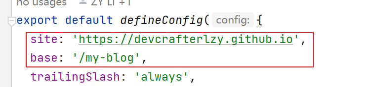
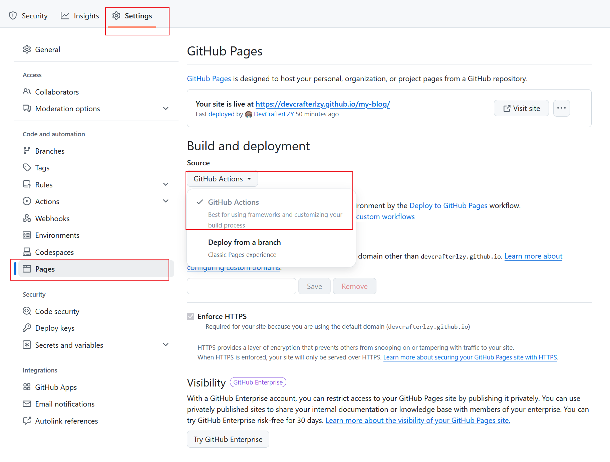

## 配置博客

This blog is built with [fuwari](https://github.com/saicaca/fuwari).

#### 1. fork [fuwari](https://github.com/saicaca/fuwari)
#### 2. 配置github的workflows
在你的项目中创建一个新文件，路径为 `.github/workflows/deploy.yml`，然后将下面的 YAML 内容粘贴进去。
```yaml
name: Deploy to GitHub Pages

on:
  # Trigger the workflow every time you push to the `main` branch
  # Using a different branch name? Replace `main` with your branch’s name
  push:
    branches: [ main ]
  # Allows you to run this workflow manually from the Actions tab on GitHub.
  workflow_dispatch:

# Allow this job to clone the repo and create a page deployment
permissions:
  contents: read
  pages: write
  id-token: write

jobs:
  build:
    runs-on: ubuntu-latest
    steps:
      - name: Checkout your repository using git
        uses: actions/checkout@v4
      - name: Install, build, and upload your site
        uses: withastro/action@v3
        # with:
          # path: . # The root location of your Astro project inside the repository. (optional)
          # node-version: 20 # The specific version of Node that should be used to build your site. Defaults to 20. (optional)
          # package-manager: pnpm@latest # The Node package manager that should be used to install dependencies and build your site. Automatically detected based on your lockfile. (optional)

  deploy:
    needs: build
    runs-on: ubuntu-latest
    environment:
      name: github-pages
      url: ${{ steps.deployment.outputs.page_url }}
    steps:
      - name: Deploy to GitHub Pages
        id: deployment
        uses: actions/deploy-pages@v4
```
#### 3. 修改astro.config.mjs文件

其中site为`https://<你的github用户名>.github.io`

base为`/<你github中该项目的名称>`

#### 4. github配置


